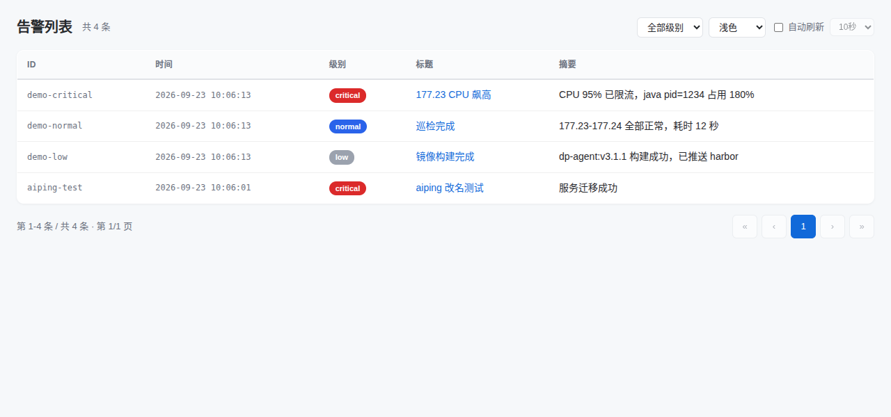
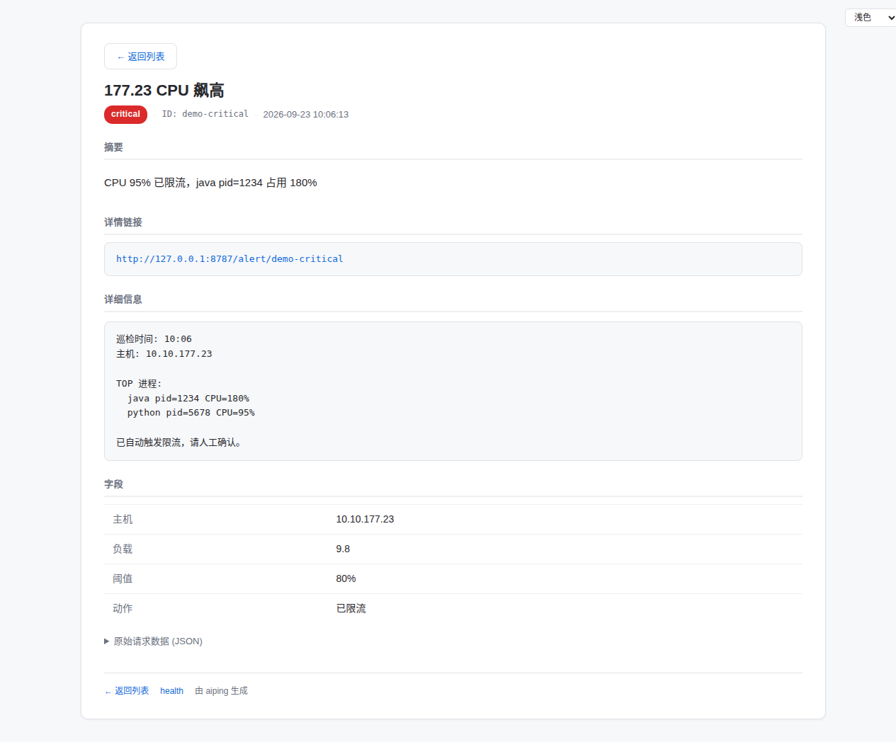

# aiping

> HTTP → Ubuntu 桌面通知，为 AI agent 设计。

**aiping** 让你的 AI agent、巡检任务、定时脚本通过一个简单的 HTTP POST 就能在 Ubuntu 桌面弹出 GNOME 系统通知。通知里带可点击的详情页链接，点开即看完整告警信息（多行详情、字段表格、原始 JSON）。

```
curl -s -X POST http://127.0.0.1:8787/notify \
  -H 'Content-Type: application/json' \
  -d '{"title":"CPU 飙高","body":"CPU 95%","urgency":"critical","detail":"...","fields":{"host":"10.0.0.1"}}'
```

桌面弹出通知 → 点通知里的 URL → 浏览器打开详情页。

## 效果截图

### 告警列表页



### 告警详情页



## 功能特性

- 🔔 **系统通知**：调用 GNOME 原生通知，进通知中心、可响铃、critical 级常驻
- 🔗 **可点击详情页**：通知 body 里带详情页 URL，点击打开结构化详情（标题/摘要/多行详情/字段表格/原始 JSON）
- 🎨 **5 套主题**：浅色、深色、护眼绿、暖色、夜蓝，列表页和详情页联动，选择存 localStorage
- 📋 **告警列表**：按时间倒序，默认 100 条/页，支持翻页
- 🔍 **级别筛选**：按 critical / normal / low 筛选
- 🔄 **自动刷新**：可开关，5/10/30/60 秒间隔可选
- 🏷️ **级别图标**：critical → ⚠️ 警告图标，normal/low → ℹ️ 信息图标
- 📦 **零依赖**：纯 Python 标准库 + PyGObject（Ubuntu 自带），无需 pip install
- 🔐 **可选鉴权**：支持 token 认证，默认仅监听 127.0.0.1
- 🚇 **远程友好**：SSH 反向隧道对接远程巡检机，零开放端口

## 系统要求

- **仅支持 Ubuntu**（GNOME 桌面环境）
- Python 3.8+
- PyGObject + libnotify（Ubuntu 默认已装）
- systemd --user（用于托管服务）

> 已在 Ubuntu + GNOME Shell 50.1 实测通过。

## 安装

### 1. 安装依赖（Ubuntu 通常已有）

```bash
sudo apt install python3-gi gir1.2-notify-0.7 libnotify-bin
```

### 2. 放置脚本

```bash
mkdir -p ~/.local/bin
cp aiping.py ~/.local/bin/aiping.py
chmod +x ~/.local/bin/aiping.py
```

### 3. 安装 systemd 服务

```bash
mkdir -p ~/.config/systemd/user
cp systemd/aiping.service ~/.config/systemd/user/
systemctl --user daemon-reload
systemctl --user enable --now aiping
```

### 4. 验证

```bash
curl http://127.0.0.1:8787/health
# {"ok": true, "service": "aiping", "app": "Aiping", ...}

# 发一条测试通知
curl -s -X POST http://127.0.0.1:8787/notify \
  -H 'Content-Type: application/json' \
  -d '{"title":"Hello","body":"aiping 已就绪","urgency":"normal"}'
```

## 调用方式

### 基本调用

```bash
curl -s -X POST http://127.0.0.1:8787/notify \
  -H 'Content-Type: application/json' \
  -d '{
    "id": "cpu-alert-001",
    "title": "177.23 CPU 飙高",
    "body": "CPU 95% 已限流",
    "urgency": "critical",
    "detail": "巡检时间: 09:40\n主机: 10.10.177.23\n\nTOP 进程:\n  java pid=1234 CPU=180%",
    "fields": {
      "主机": "10.10.177.23",
      "负载": 9.8,
      "阈值": "80%",
      "动作": "已限流"
    }
  }'
```

### 通知效果

通知弹出后：

- **第一行（title）**：告警标题 + 摘要（如 `177.23 CPU 飙高 — CPU 95% 已限流`）
- **第二行（body）**：详情页 URL，**点击即可打开详情页**
- **图标**：critical → ⚠️，normal/low → ℹ️

### 字段说明

| 字段 | 必填 | 说明 |
|---|---|---|
| `title` | 是 | 通知标题 |
| `body` | 否 | 摘要文字，会并到 title 显示 |
| `urgency` | 否 | `critical`（常驻+响铃）/ `normal`（默认）/ `low`（静默） |
| `id` | 否 | 幂等 id，不传自动生成。同 id 重复发会覆盖 |
| `detail` | 否 | 多行详细文本，详情页用 `<pre>` 渲染 |
| `fields` | 否 | 键值对象，详情页渲染成表格 |
| *其他字段* | 否 | 任意额外数据，详情页"附加数据"区展示 |

### 页面

| 路径 | 说明 |
|---|---|
| `GET /alerts` | 告警列表页（分页、筛选、自动刷新、主题切换） |
| `GET /alert/<id>` | 单条告警详情页 |
| `GET /health` | 健康检查 |
| `POST /notify` | 发送通知 |

## 远程巡检机对接

### 方式 A：SSH 反向隧道（推荐，零开放端口）

```bash
# 在远程巡检机上建一次（可配 autossh 常驻）
ssh -fN -R 8787:127.0.0.1:8787 user@你PC的IP

# 之后远程机上直接当本地接口调用
curl -s -X POST http://127.0.0.1:8787/notify -d '{...}'
```

### 方式 B：开放端口 + token

编辑 `~/.config/systemd/user/aiping.service`，取消注释：

```
Environment=AIPING_HOST=0.0.0.0
Environment=AIPING_TOKEN=你设一个长串
```

```bash
systemctl --user daemon-reload && systemctl --user restart aiping
```

调用时带鉴权头：

```bash
curl -s -X POST http://你的IP:8787/notify \
  -H 'Authorization: Bearer 你的串' \
  -H 'Content-Type: application/json' \
  -d '{...}'
```

记得用 ufw 只放行可信网段。

## 运维命令

```bash
systemctl --user status aiping        # 状态
systemctl --user restart aiping       # 重启
journalctl --user -u aiping -f        # 实时日志
```

## 配置（环境变量）

| 变量 | 默认值 | 说明 |
|---|---|---|
| `AIPING_HOST` | `127.0.0.1` | 监听地址，远程调用设 `0.0.0.0` |
| `AIPING_PORT` | `8787` | 端口 |
| `AIPING_TOKEN` | （空） | 鉴权 token，留空不校验 |
| `AIPING_APP` | `Aiping` | 通知应用名 |

## 已知限制

- **GNOME 50 通知 body 单行渲染**：通知弹出预览的 body 强制单行，`\n` / `<br>` / Pango markup 均无法换行。因此采用 title=摘要、body=URL 的组装方式，预览里 URL 单独第二行可点击。
- **通知 action 回调不可用**：GNOME 50 移除了通知 action 回调，点击详情改用 body 里的纯 URL 链接。
- **告警存内存**：重启服务会清空告警历史（最多保留 500 条）。

## License

MIT

---

<p align="center">@glango.cn</p>
